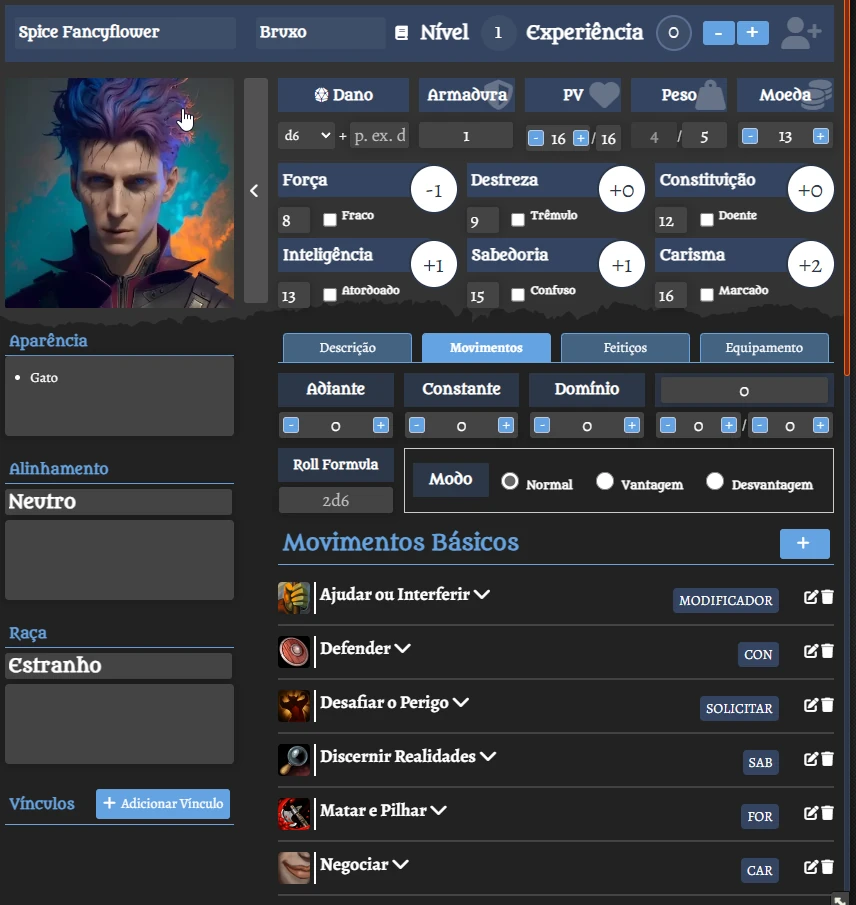

# Dungeon World - Tradução para o Português (Brasil)
Esse módulo aplica a tradução para o sistema Dungeon World.

## Ficha
<table>
<thead>
  <tr>
    <th>
      

        
      

    </th>
  </tr>
</thead>
</table> 

# Instruções
1. Ativa o módulo.
2. Selecione português do Brasil em configurações.

# Instalação

## Instalação Automática
Pesquise **Dungeon World - Tradução** em módulos. Depois instale.

## Instalação Manual
Vá em **módulos** e coloque o link abaixo. 
Link: https://raw.githubusercontent.com/brunocalado/dungeon-world-ptbr/main/module.json

# PDF
Acesse a tradução oficial brasileira: [https://seculargames.com.br/loja/index.php/produto/dungeon-world-pdf/](https://seculargames.com.br/loja/index.php/produto/dungeon-world-pdf/)

# Alterações
Você pode verificar por mudanças em [MUDANÇAS](CHANGELOG.md)

# License
Compendium content is licensed under the Creative Commons Attribution 3.0 Unported License. To view a copy of this license, visit http://creativecommons.org/licenses/by/3.0/ or send a letter to Creative Commons, 444 Castro Street, Suite 900, Mountain View, California, 94041, USA.